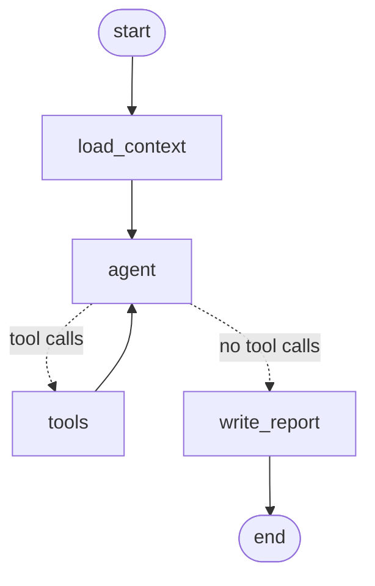

# 08 – Meeting agent (breakout: what would you test?)

Slide: *Breakout: Testing a Meeting Agent*.

A planning agent for a software team, built with [LangGraph](https://langchain-ai.github.io/langgraph/).
It has access to the team's GitHub issues. Before a meeting, it writes the
agenda. After the meeting, it reads the transcript and updates the issues:
it closes issues, assigns issues, creates new issues, and adds comments. It
must refuse to change issues that do not exist.

**This project has no tests and no stubs, on purpose.** Read the code and
decide what to test, and how. Start with `process_transcript` in
`meeting_agent/agent.py`.

| File | Content |
|---|---|
| `meeting_agent/agent.py` | Two LangGraph graphs: `process_transcript` (tool-calling loop) and `generate_agenda` (fixed steps) |
| `meeting_agent/tools.py` | Tools for the model: list, get, close, assign, create, comment; dry-run mode and an action log |
| `meeting_agent/prompts.py` | System prompts for both graphs |
| `meeting_agent/issues.py` | GitHub REST API client |
| `meeting_agent/transcripts.py` | Loads transcripts (speech-to-text is not connected) |
| `data/standup-2026-09-22.txt` | A sample transcript |
| `data/team.json` | Names used in meetings → GitHub logins |

The graph for `process_transcript`:



## Run

The code needs a GitHub token and an API key for a model (any
[litellm model name](https://docs.litellm.ai/docs/providers) in `LLM_MODEL`).
It was not run against a real repository.

```sh
uv run python -m meeting_agent graph      # print both graphs (no GitHub or model access needed)

export GITHUB_TOKEN=... LLM_MODEL=anthropic/claude-opus-5 ANTHROPIC_API_KEY=...
uv run python -m meeting_agent --repo owner/name agenda
uv run python -m meeting_agent --repo owner/name process data/standup-2026-09-22.txt          # dry run
uv run python -m meeting_agent --repo owner/name process data/standup-2026-09-22.txt --apply  # change issues
```
